<div align="center">

# TVS Spaces

### Flexible workspace booking, from discovery to confirmed reservation.

A production-style **Angular 20 + Spring Boot** booking platform for coworking desks and meeting rooms in Heliopolis, Cairo — with real-time availability, server-authoritative pricing, secure JWT authentication, persistent reservations, and responsive desktop/mobile experiences.

[](https://angular.dev/)
[](https://www.typescriptlang.org/)
[](https://spring.io/projects/spring-boot)
[](https://www.mysql.com/)
[](https://playwright.dev/)
[](https://tvs-spaces.vercel.app/)

**[🌐 Live App](https://tvs-spaces.vercel.app/)** · **[▶ Watch 69s Product Demo](https://tvs-spaces.vercel.app/tvs-spaces-demo-cv.mp4)** · **[⚙️ Backend Repository](https://github.com/shawky2002020/TvsSpaces-back)**

</div>

---

## ▶ Product Walkthrough

The portfolio demo follows the complete customer journey — **discover → inspect → authenticate → configure → validate → price → review → checkout → confirm → manage**.

<p align="center">
  <a href="https://tvs-spaces.vercel.app/tvs-spaces-demo-cv.mp4">
    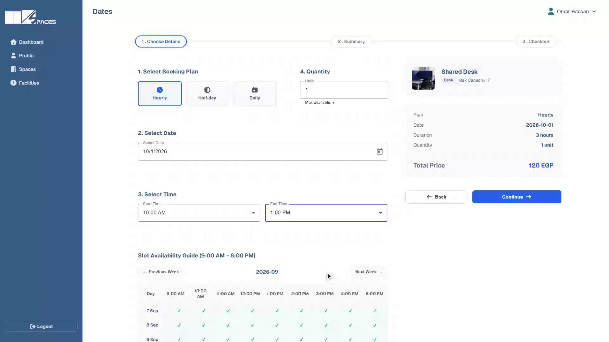
  </a>
</p>

<p align="center"><strong>Click the preview to watch the 1080p end-to-end demo.</strong></p>

### Booking interaction preview

<p align="center">
  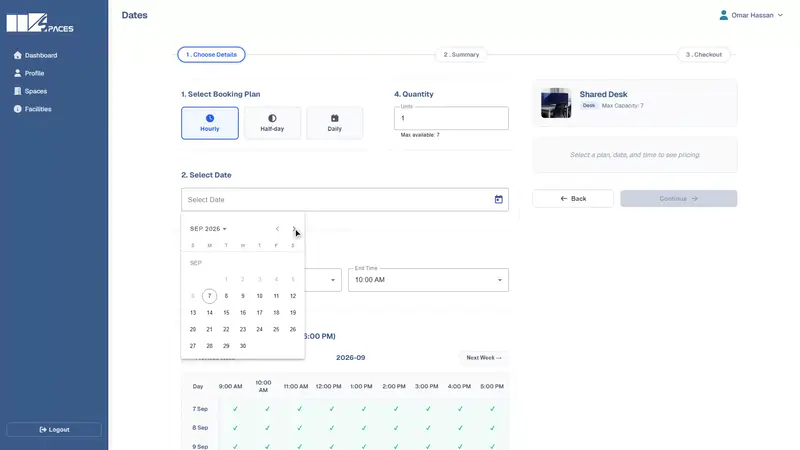
</p>

The demo uses the real Angular client, Spring Boot API, booking rules, MySQL persistence, and server-side quote calculation — not a mocked UI-only flow.

---

## ✨ Product Experience

### 1. Discover flexible workspaces

Browse desks and meeting rooms, compare capacity and pricing, inspect amenities, and open the workspace gallery before booking.

<table>
  <tr>
    <td width="50%"></td>
    <td width="50%">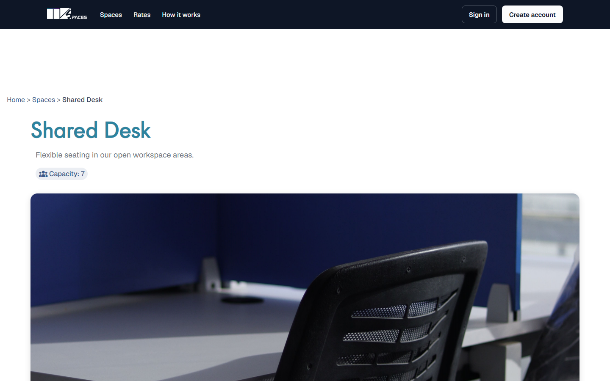</td>
  </tr>
  <tr>
    <td align="center"><strong>Workspace discovery</strong></td>
    <td align="center"><strong>Space details & pricing</strong></td>
  </tr>
</table>

### 2. Configure a reservation with live backend validation

Select the workspace, booking plan, date, start/end time, and quantity. The Spring Boot backend validates availability/capacity and returns the authoritative price quote before the user can continue.

<table>
  <tr>
    <td width="50%">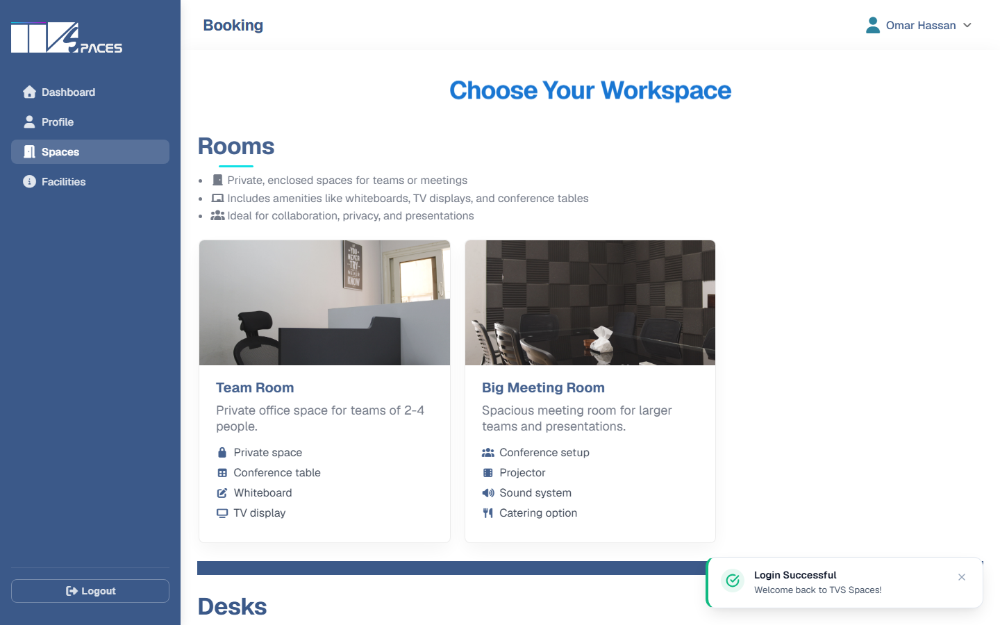</td>
    <td width="50%"></td>
  </tr>
  <tr>
    <td align="center"><strong>Choose a workspace</strong></td>
    <td align="center"><strong>Date, time & server quote</strong></td>
  </tr>
</table>

### 3. Review, checkout, and persist the booking

The reservation summary keeps the selected space, plan, schedule, and calculated price visible before checkout. **Pay at Venue** creates a persistent `CONFIRMED` reservation through the REST API.

<table>
  <tr>
    <td width="50%">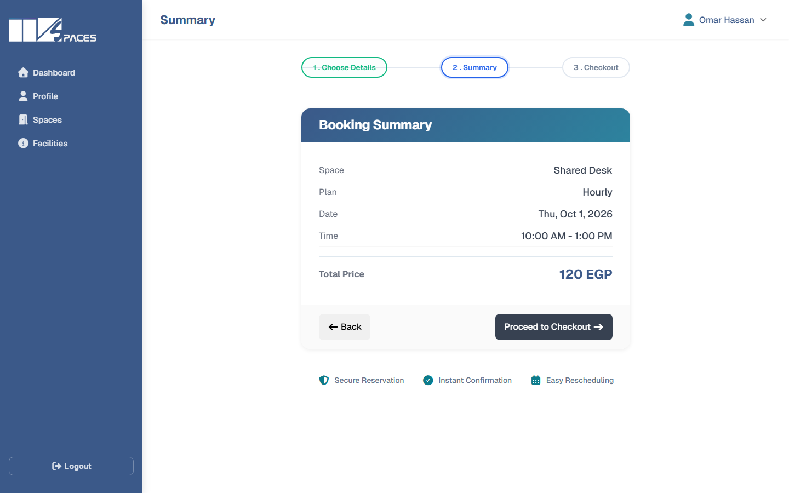</td>
    <td width="50%">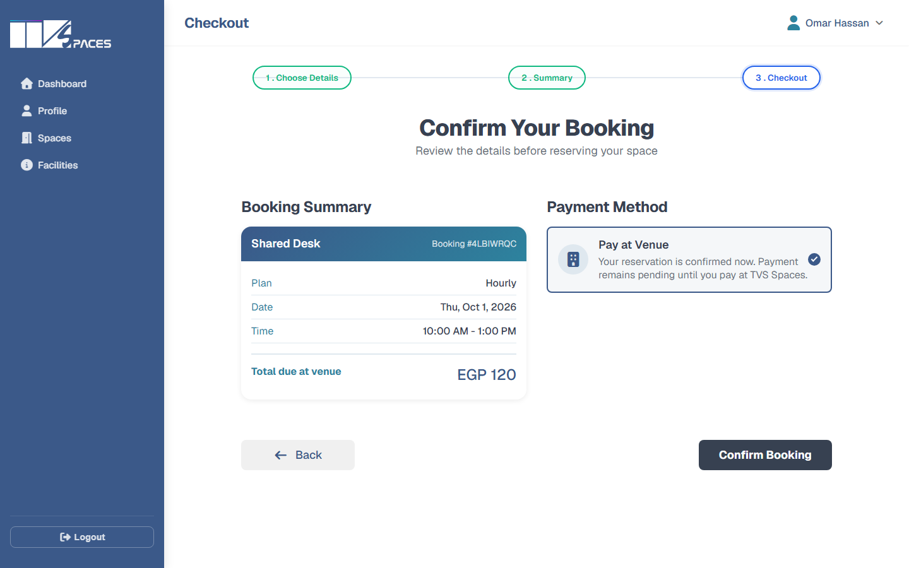</td>
  </tr>
  <tr>
    <td align="center"><strong>Booking summary</strong></td>
    <td align="center"><strong>Checkout & confirmation</strong></td>
  </tr>
</table>

### 4. Manage reservations from the dashboard

Customers can see reservation metrics and booking history in one place, including upcoming/cancelled states and reservation-management actions.

<p align="center">
  
</p>

### 5. Responsive by design

The complete experience is adapted for mobile — not just the landing page.

<table>
  <tr>
    <td width="33%" align="center"></td>
    <td width="33%" align="center">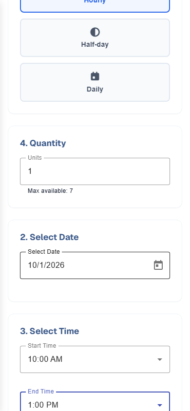</td>
    <td width="33%" align="center">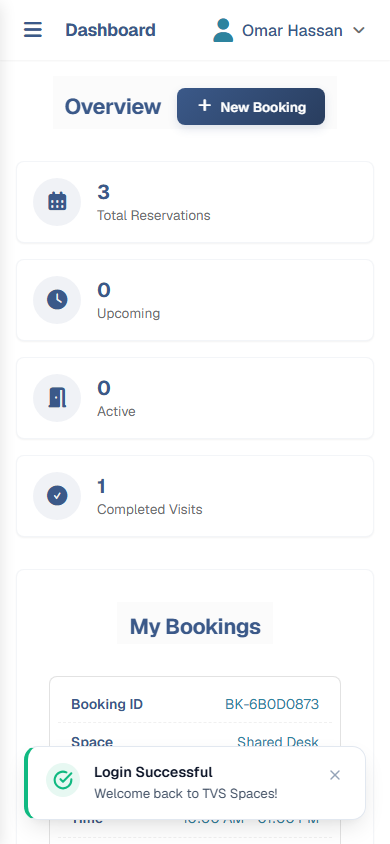</td>
  </tr>
  <tr>
    <td align="center"><strong>Discovery</strong></td>
    <td align="center"><strong>Booking</strong></td>
    <td align="center"><strong>Dashboard</strong></td>
  </tr>
</table>

---

## 🔁 Complete User Journey

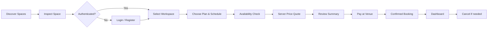

### What happens during booking

1. **Catalog** — spaces are loaded from the Spring Boot API.
2. **Selection** — the Angular booking store keeps the selected workspace and plan across the stepper.
3. **Availability** — the server checks overlapping reservations and capacity.
4. **Pricing** — the backend calculates the authoritative quote; the UI displays it rather than trusting a client-only price.
5. **Checkout** — the booking is submitted with the selected payment method.
6. **Persistence** — MySQL stores the reservation and generated booking reference.
7. **Management** — the dashboard reads the user's reservations and supports cancellation.

---

## 🏗 System Architecture

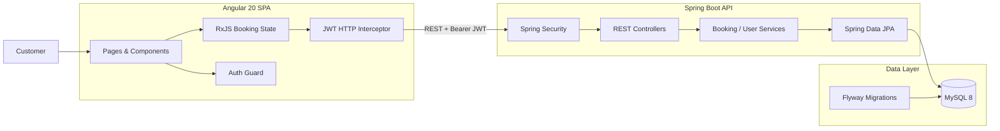

### Booking creation sequence

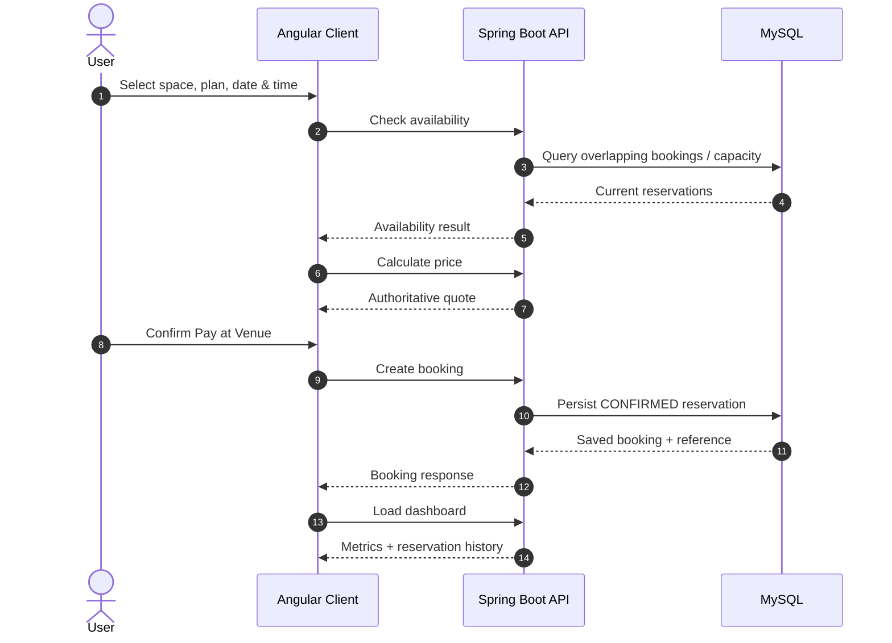

---

## 🔐 Authentication & Security

TVS Spaces uses a dual-token authentication model:

- short-lived **JWT access token** for authenticated API requests;
- **HttpOnly refresh cookie** for session renewal;
- Angular HTTP interceptor attaches access tokens and retries after refresh;
- Spring Security protects authenticated routes and validates JWTs;
- refresh sessions are persisted server-side as hashes rather than storing the raw refresh token;
- passwords are protected with BCrypt in the backend.

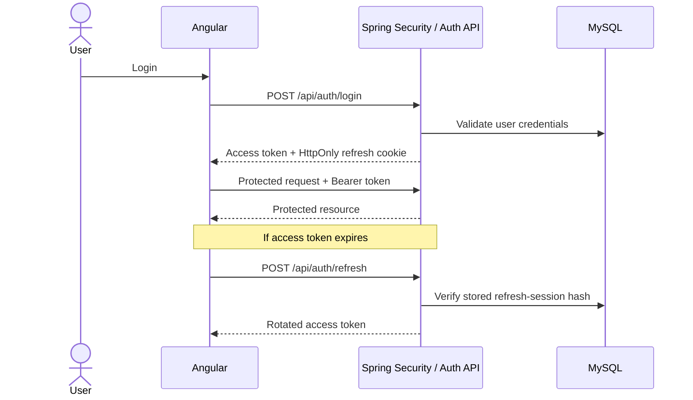

---

## 🧩 Engineering Highlights

| Area | Implementation |
| :--- | :--- |
| **Frontend** | Angular 20, TypeScript 5.8, Angular Material, SCSS design tokens |
| **State & async** | RxJS-driven booking flow and API orchestration |
| **Backend** | Spring Boot REST API with controller/service/repository layers |
| **Security** | Spring Security, JWT access tokens, HttpOnly refresh cookies, BCrypt |
| **Persistence** | MySQL 8, Spring Data JPA, Flyway migrations |
| **Booking engine** | Server-side availability/capacity validation and authoritative pricing |
| **UX** | Multi-step reservation flow, image lightbox, dashboard states, responsive layouts |
| **Quality** | Playwright E2E coverage, automated screenshot capture, Angular and backend tests |
| **Deployment** | Angular on Vercel; Spring Boot API on Render |

---

## 🧪 Verified End-to-End Scenario

The portfolio walkthrough validates a real reservation lifecycle:

```text
Landing
  → Shared Desk details
  → Authentication
  → Shared Desk selection
  → Hourly plan
  → Future date
  → 10:00 AM – 1:00 PM
  → Backend availability validation
  → 120 EGP server-calculated quote
  → Booking summary
  → Pay at Venue
  → CONFIRMED reservation
  → Dashboard update
  → Cancellation
```

### Quality gates

| Check | Result |
| :--- | :--- |
| Angular production build | ✅ Passed |
| Spring Boot tests | ✅ Passed — 0 failures / 0 errors |
| Booking Playwright E2E | ✅ Passed |
| Console / unexpected network errors in demo | ✅ Clean |
| Video visual QA / freeze detection | ✅ Passed |
| Desktop screenshot coverage | ✅ Captured |
| Mobile screenshot coverage | ✅ Captured |

---

## 📸 More Screens

<table>
  <tr>
    <td width="50%">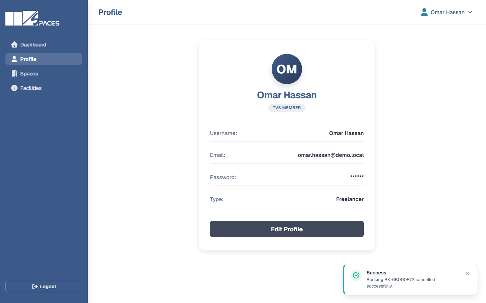</td>
    <td width="50%">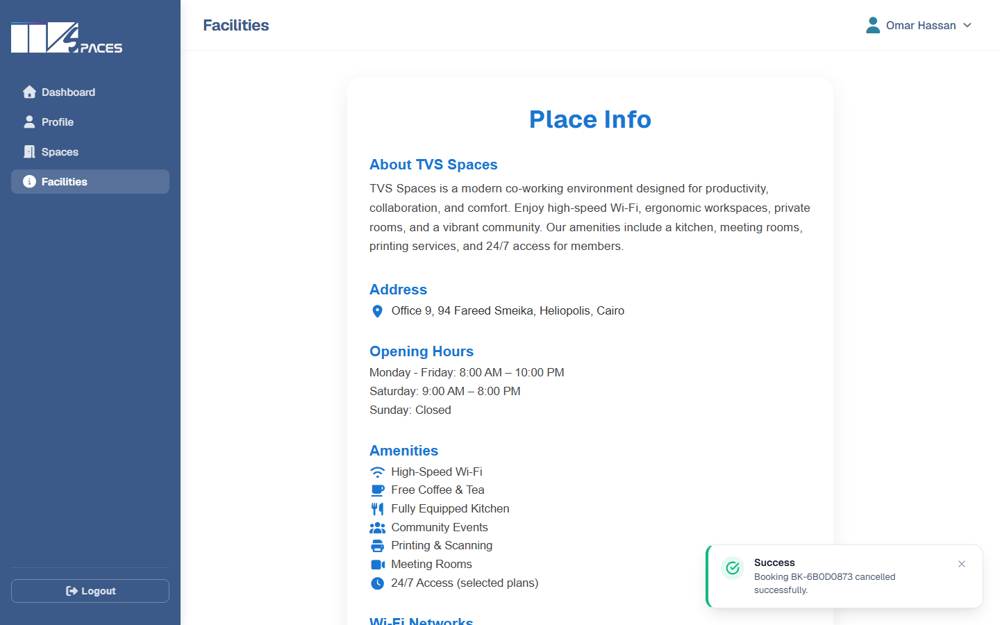</td>
  </tr>
  <tr>
    <td align="center"><strong>Profile & account settings</strong></td>
    <td align="center"><strong>Facilities & venue guide</strong></td>
  </tr>
</table>

---

## 🗺 Route Map

| Path | Access | Purpose |
| :--- | :--- | :--- |
| `/` | Public | Landing, workspace catalog & discovery |
| `/rooms/:type` | Public | Meeting-room details, gallery & pricing |
| `/desks/:type` | Public | Desk details, amenities & pricing |
| `/auth/login` | Public | Authentication |
| `/auth/register` | Public | Account creation |
| `/dashboard` | Protected | Reservation metrics & management |
| `/dashboard/booking` | Protected | Workspace selection |
| `/dashboard/booking/dates` | Protected | Plan, date, time & live quote |
| `/dashboard/booking/summary` | Protected | Reservation review |
| `/dashboard/booking/checkout` | Protected | Payment method & booking creation |
| `/dashboard/profile` | Protected | Profile and password management |
| `/dashboard/facilities` | Protected | Facilities, rules & operating information |

---

## 🚀 Run Locally

### Frontend

```bash
git clone https://github.com/shawky2002020/tvs-spaces.git
cd tvs-spaces
npm ci
npm start
```

The Angular app runs at `http://localhost:4200`.

For a production build:

```bash
npm run build
```

For Playwright E2E tests:

```bash
npm run e2e
```

### Backend

The API lives in a separate repository:

**https://github.com/shawky2002020/TvsSpaces-back**

It provides authentication, workspace catalog, availability checks, price calculation, booking persistence, cancellation, dashboard statistics, and user profile APIs.

---

## 🌍 Deployment

| Service | URL |
| :--- | :--- |
| **Frontend** | https://tvs-spaces.vercel.app/ |
| **Backend** | https://tvs-spaces-back.onrender.com/api |
| **Product demo** | https://tvs-spaces.vercel.app/tvs-spaces-demo-cv.mp4 |

> The Render backend may require a short cold-start period on the first request after inactivity.

---

## Current Scope

- Reservations currently use **Pay at Venue**; online card processing is not presented as a completed feature.
- The application requires backend connectivity for live availability and server-authoritative quotes.

---

<div align="center">

### TVS Spaces

**Angular · Spring Boot · MySQL · Secure Auth · Real Booking Flow · Responsive UI**

**[Open Live App](https://tvs-spaces.vercel.app/)** · **[Watch Demo](https://tvs-spaces.vercel.app/tvs-spaces-demo-cv.mp4)** · **[Backend](https://github.com/shawky2002020/TvsSpaces-back)**

</div>
