# TVS Spaces | Client Application

[](https://angular.dev/)
[](https://www.typescriptlang.org/)
[](https://sass-lang.com/)
[](https://playwright.dev/)
[](https://client-three-zeta-29.vercel.app/)

A modern, high-performance Single Page Application (SPA) built with **Angular 20** for reserving flexible coworking desks and private meeting rooms at **TVS Spaces** in Heliopolis, Cairo. Connected to a Spring Boot REST API and MySQL backend.

> **Backend Repository**: [`shawky2002020/TvsSpaces-back`](https://github.com/shawky2002020/TvsSpaces-back)  
> **Status**: Functional booking client integrated with Spring Boot REST API and MySQL persistence.

---

## Table of Contents

- [Product Overview](#product-overview)
- [Visual Walkthrough & Screenshots](#visual-walkthrough--screenshots)
- [System Architecture](#system-architecture)
- [User Journey](#user-journey)
- [Frontend Architecture](#frontend-architecture)
- [Route Map](#route-map)
- [Key Features](#key-features)
- [Technology Stack](#technology-stack)
- [Directory Structure](#directory-structure)
- [Authentication Flow](#authentication-flow)
- [Booking State Flow](#booking-state-flow)
- [Local Setup & Configuration](#local-setup--configuration)
- [Testing & Quality Assurance](#testing--quality-assurance)
- [Deployment](#deployment)
- [Current Limitations](#current-limitations)

---

## Product Overview

TVS Spaces eliminates friction when reserving workspace in Heliopolis, Cairo. It enables freelancers, remote professionals, startups, and enterprise teams to seamlessly discover, configure, check availability, and book workspace on flexible terms:

- **Hourly Booking**: Rent desks or meeting rooms for precise time slots (e.g. 09:00 to 12:00).
- **Daily & Half-Day Booking**: Reserve full-day workspace access (09:00 to 18:00) or 4-hour blocks with discounted tier pricing.
- **Server-Authoritative Pricing & Availability**: Instant real-time grid checks directly against the Spring Boot database preventing double bookings.
- **Pay-at-Venue Confirmation**: Bookings are reserved instantly with `CONFIRMED` status, ready for check-in at TVS Spaces.

---

## Visual Walkthrough & Screenshots

Below are authentic screenshots captured directly from the running Angular application across Desktop (`1440×900`) and Mobile (`390×844`) viewports.

<table>
  <tr>
    <td align="center" width="50%"><strong>Landing Page (Desktop)</strong></td>
    <td align="center" width="50%"><strong>Room Details & Lightbox (Desktop)</strong></td>
  </tr>
  <tr>
    <td>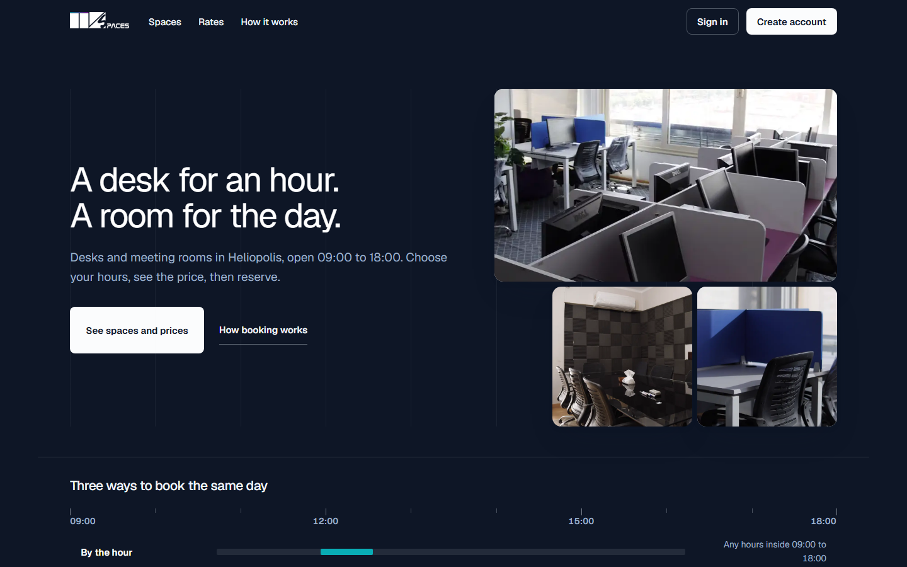</td>
    <td>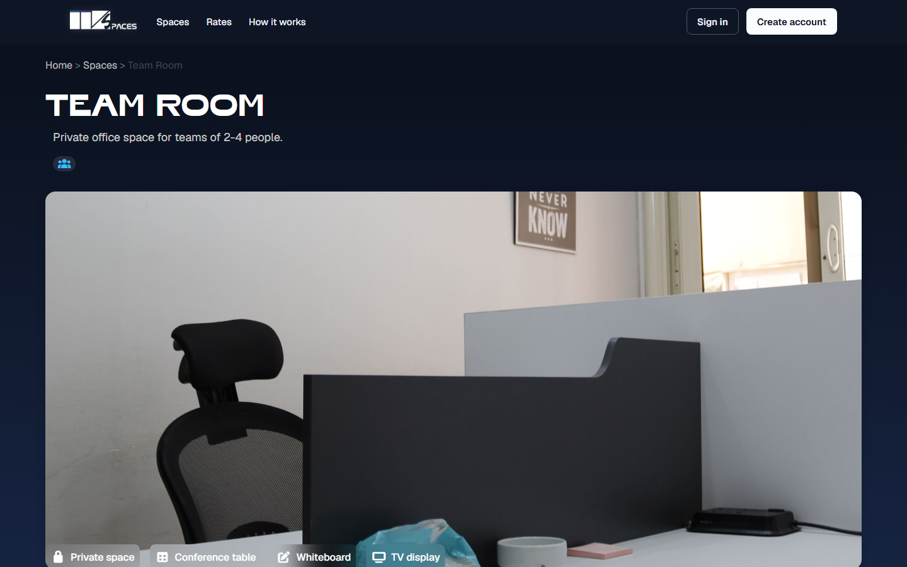</td>
  </tr>
  <tr>
    <td align="center">Clean typography, category filters, interactive space cards</td>
    <td align="center">Full space specs, amenities grid, pricing packages, interactive image gallery</td>
  </tr>
  <tr>
    <td align="center" width="50%"><strong>Date & Plan Stepper (Desktop)</strong></td>
    <td align="center" width="50%"><strong>User Dashboard (Desktop)</strong></td>
  </tr>
  <tr>
    <td>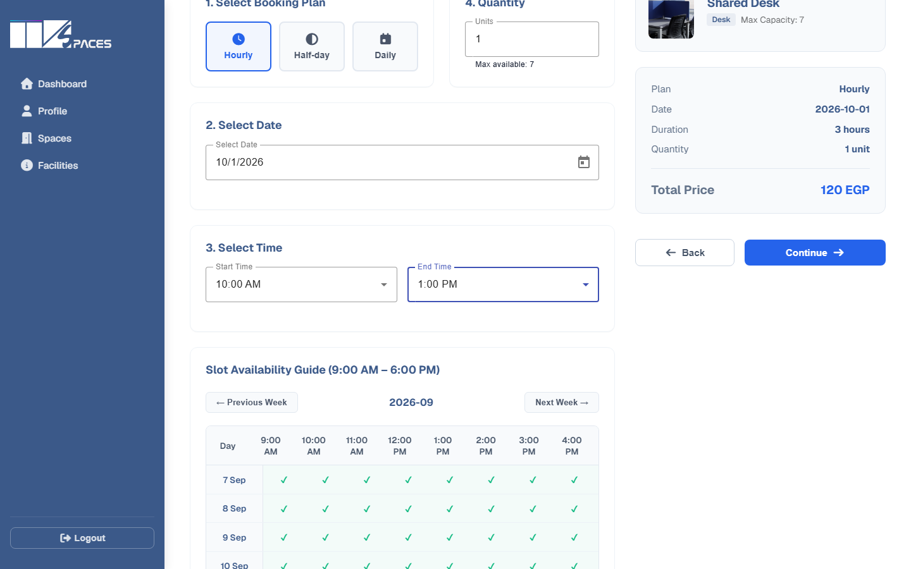</td>
    <td>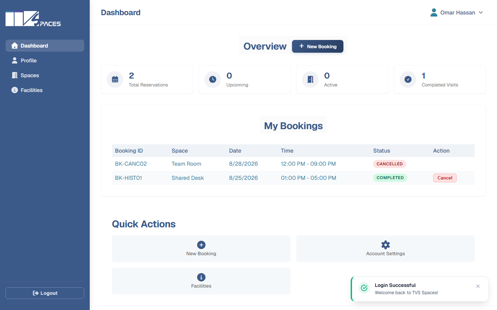</td>
  </tr>
  <tr>
    <td align="center">Interactive calendar, plan selector (Hourly/Daily), server price calculator</td>
    <td align="center">Active reservations, visit metrics, upcoming booking management & cancellations</td>
  </tr>
  <tr>
    <td align="center" width="50%"><strong>Mobile Experience - Landing</strong></td>
    <td align="center" width="50%"><strong>Mobile Experience - Desk Details</strong></td>
  </tr>
  <tr>
    <td>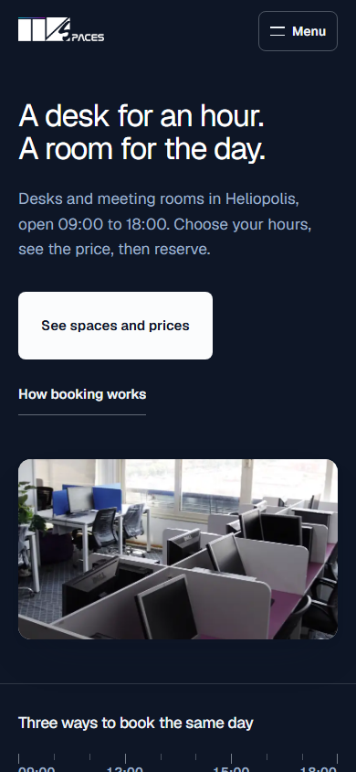</td>
    <td>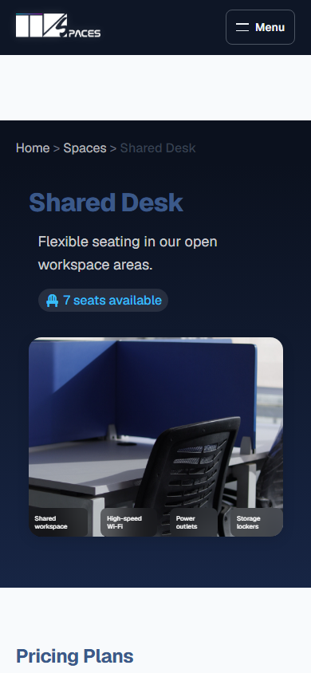</td>
  </tr>
  <tr>
    <td align="center">Fluid mobile header, responsive drawer navigation</td>
    <td align="center">Touch-friendly gallery slider, full-width plan selection CTA</td>
  </tr>
</table>

---

## System Architecture

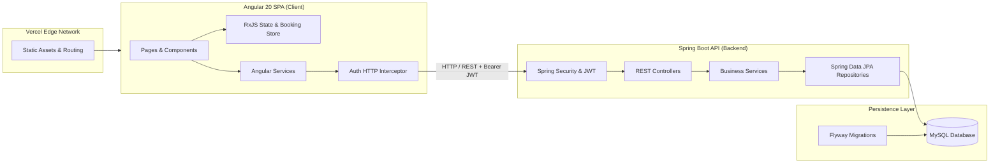

---

## User Journey

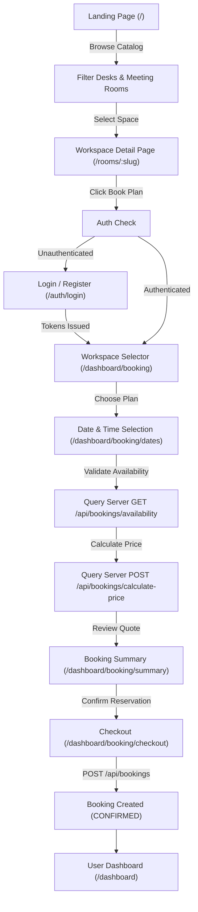

---

## Frontend Architecture

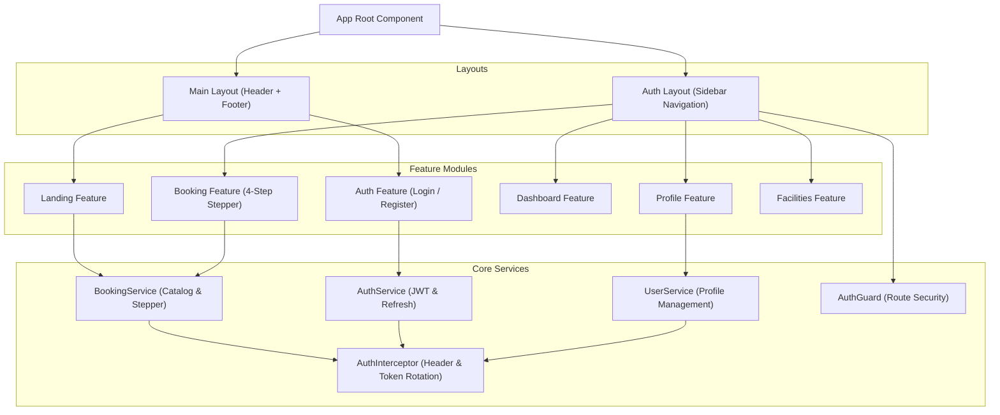

---

## Route Map

| Path | Access Level | Purpose | Main Component |
| :--- | :--- | :--- | :--- |
| `/` | Public | Primary landing page, space showcase, features, & filters | `LandingPageComponent` |
| `/rooms/:type` | Public | Meeting room detail view, image gallery, & pricing | `RoomDetailComponent` |
| `/desks/:type` | Public | Coworking desk detail view, image gallery, & specs | `DeskDetailComponent` |
| `/auth/login` | Public | Account authentication & credential submission | `Login` |
| `/auth/register` | Public | New user registration form | `Register` |
| `/payment-required` | Public | License & billing restriction notice page | `PaymentRequiredComponent` |
| `/dashboard` | Protected | User dashboard metrics & reservation management | `DashboardComponent` |
| `/dashboard/booking` | Protected | Workspace type selection for booking | `ResourceSelectorComponent` |
| `/dashboard/booking/dates` | Protected | Date, time, & duration picker with live server quote | `DatePlanPickerComponent` |
| `/dashboard/booking/summary` | Protected | Final booking review & pricing breakdown | `BookingSummaryComponent` |
| `/dashboard/booking/checkout` | Protected | Payment method selection & final booking submission | `CheckoutComponent` |
| `/dashboard/profile` | Protected | User profile updates & password changes | `ProfileComponent` |
| `/dashboard/facilities` | Protected | Venue facilities, Wi-Fi guide, rules & operating hours | `PlaceInfoComponent` |
| `**` | Public | Custom 404 Page Not Found error page | `NotFoundComponent` |

---

## Key Features

- **Dynamic Modular Layouts**: Dual layout shell structure supporting header-driven public landing pages and drawer-driven dashboard layouts.
- **Dynamic SEO Management**: Angular `Title` and `Meta` services update document titles, meta descriptions, OpenGraph tags, and canonical links per route.
- **Server-Synced Booking Engine**: RxJS-powered state manager handles multi-step booking validation across space selection, date picker, live server pricing calculation, and checkout.
- **Interactive Lightbox Modal**: High-resolution image preview lightbox for inspecting room and desk gallery photos.
- **Automatic Token Refresh Interceptor**: `AuthInterceptor` attaches `Bearer` JWT tokens to outgoing requests and seamlessly rotates access tokens when receiving 401 responses.
- **Fluid SCSS Design Token System**: Custom modular CSS tokens for typography, spacing, shadows, responsive breakpoints, and theme variables.

---

## Technology Stack

| Domain | Technology | Version | Purpose |
| :--- | :--- | :--- | :--- |
| **Framework** | Angular | `20.2.1` | Standalone & module-based SPA architecture |
| **Language** | TypeScript | `5.8.2` | Type-safe models, DTOs, and component logic |
| **Styling** | SCSS / Angular Material | `20.2.0` | Custom design token system & Material components |
| **State / Async** | RxJS / Moment.js | `7.8.0` / `2.30.1` | Reactive streams & date/time parsing |
| **Testing** | Playwright / Karma | `1.62.1` / `6.4.0` | End-to-end testing, visual screenshots, & unit tests |
| **Deployment** | Vercel | `Latest` | Global edge network SPA deployment |

---

## Directory Structure

```text
client/
├── e2e/                             # Playwright E2E tests & screenshot automation
│   ├── booking.spec.ts
│   ├── capture-all-docs.spec.ts
│   └── landing.spec.ts
├── public/                          # Static public assets served at root
│   ├── logo/                        # TVS Spaces logos
│   ├── favicon.ico                  # TVS Spaces primary favicon
│   ├── robots.txt                   # Search crawler directives
│   └── sitemap.xml                  # Search engine index sitemap
├── src/
│   ├── app/
│   │   ├── core/                    # Guards, interceptors, services
│   │   │   ├── guards/              # AuthGuard
│   │   │   ├── interceptors/        # AuthInterceptor
│   │   │   └── services/            # AuthService
│   │   ├── features/                # Domain feature modules
│   │   │   ├── auth/                # Login & Registration
│   │   │   ├── booking/             # Multi-step reservation flow
│   │   │   ├── dashboard/           # Metrics & reservation list
│   │   │   ├── landing/             # Hero, catalog, & amenities
│   │   │   ├── place-info/          # Venue facilities & rules
│   │   │   └── profile/             # User settings & security
│   │   ├── layouts/                 # App shells (MainLayout, AuthLayout)
│   │   ├── pages/                   # Room & Desk detail standalone pages
│   │   └── shared/                  # Common components, pipes, & constants
│   ├── assets/                      # Workspace imagery & stylesheets
│   ├── environments/                # Environment configurations (local vs prod)
│   ├── index.html                   # HTML5 root document with SEO tags
│   └── styles.scss                  # Global SCSS imports
├── playwright.config.ts             # Playwright test configuration
└── angular.json                     # Angular CLI build workspace configuration
```

---

## Authentication Flow

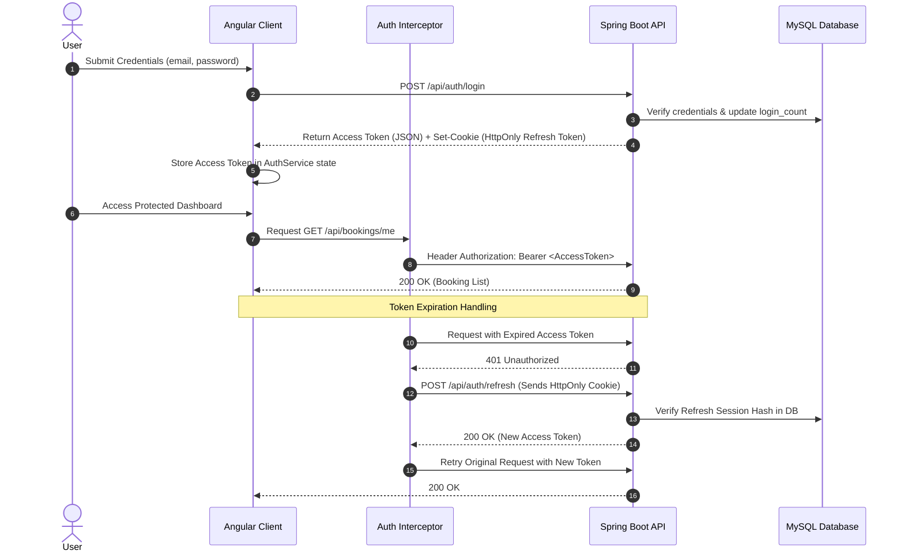

---

## Booking State Flow

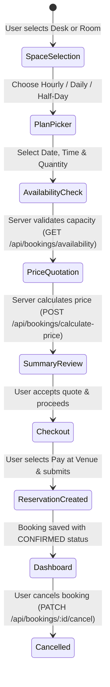

---

## Local Setup & Configuration

### Prerequisites
- **Node.js**: `v18.x` or `v20.x`
- **npm**: `v9.x` or higher
- **Backend API**: Spring Boot server running on `http://localhost:8080` (or configured via environment)

### Step 1: Install Dependencies
```bash
npm ci
```

### Step 2: Configure Environment
Edit `src/environments/environment.ts`:
```typescript
export const environment = {
  production: false,
  apiUrl: 'http://localhost:8080/api'
};
```

### Step 3: Run Development Server
```bash
npm start
```
Navigate to `http://localhost:4200/`. The app will automatically reload when source files change.

### Step 4: Build for Production
```bash
npm run build
```
Build artifacts will be stored in `dist/myApp`.

---

## Testing & Quality Assurance

### Unit Tests
Execute unit tests via Karma/Jasmine:
```bash
npm test -- --watch=false --browsers=ChromeHeadless
```

### End-to-End Tests (Playwright)
Run headless Playwright browser tests:
```bash
npm run e2e
```

### Automated Documentation Screenshots
Capture fresh desktop and mobile screenshots across all app routes:
```bash
npm run screenshots
```

---

## Deployment

The Angular client is deployed on **Vercel** with routing rewrites to support HTML5 deep linking (`Single Page Application` routing).

### Vercel Routing Configuration (`vercel.json`)
```json
{
  "rewrites": [
    { "source": "/(.*)", "destination": "/index.html" }
  ]
}
```

### Production Cross-Origin & Cookie Requirements
When deployed to production:
1. `environment.prod.ts` points to `https://tvs-spaces-back.onrender.com/api`.
2. Backend CORS must include `https://client-three-zeta-29.vercel.app`.
3. HttpOnly refresh cookies require `SameSite=None` and `Secure=true` for cross-domain cookie transmission over HTTPS.

---

## Current Limitations

- **Payment Processing**: Bookings currently operate in **Pay at Venue** mode (`PENDING` payment status). Online card integration (Stripe/Paymob) is architected in DTOs but pending payment gateway API keys.
- **Offline Mode**: The client requires active connectivity to the Spring Boot backend to query real-time space availability grids.
